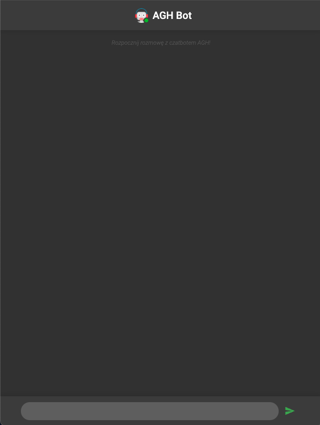
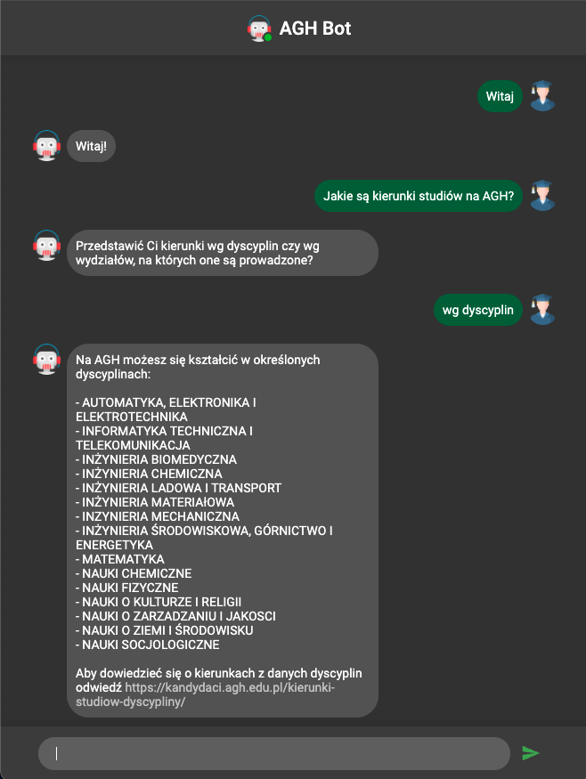

# chatbot-agh
> Chatbot app which helps users in getting crucial information about recruitment process at University of Science and Technology in Cracow.\
> Application written for the bachelor's thesis.
> Live app demonstration [_here_](https://chatbot-agh.herokuapp.com). <!-- If you have the project hosted somewhere, include the link here. -->

## Technologies Used
- Server
  * Node.js 14.16.0
  * Express 4.17.1
- Client
  * React 17.0.2
  * Redux 4.1.0
  * Styled Components 5.3.0
  * Formik 2.2.7
  * Axios 0.21.1
  * MaterialUI 4.11.4
- Chatbot functionality
  * Dialogflow 1.2.0
 

## Screenshots

 
 

<!-- If you have screenshots you'd like to share, include them here. -->

